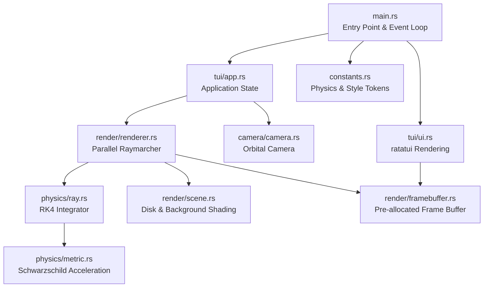

# Architecture

## Overview

The Schwarzschild Raytracer TUI is a real-time terminal-based black hole visualization engine written in Rust. It numerically integrates null geodesics (photon paths) through the Schwarzschild metric and renders the result using Unicode half-block pixels with 24-bit RGB colors in the terminal.

## System Architecture

## Module Responsibilities

### `main.rs` — Entry Point & Event Loop
- Sets up crossterm raw mode, alternate screen, and mouse capture
- Constructs `App` with default camera and frame buffer
- Runs the 60 FPS event loop: poll → handle → render → draw
- Restores terminal on exit

### `camera/camera.rs` — Orbital Camera
- Spherical coordinate system (r, θ, φ) centered on the singularity
- Generates rays through a virtual screen using a look-at matrix
- Supports orbit (mouse drag / arrow keys) and zoom (scroll / +/- keys)
- Clamps distance between photon sphere + 0.5 and 80.0

### `physics/metric.rs` — Schwarzschild Metric
- Computes the GR acceleration for null geodesics: `a = -1.5 * r_s * h² / r⁵ * pos`
- Derived from the Binet orbit equation for the Schwarzschild spacetime
- Zero allocation, pure math function

### `physics/ray.rs` — RK4 Geodesic Integrator
- 4th-order Runge-Kutta integration of coupled position/velocity ODE
- Adaptive step sizing via the lapse function `(1 - r_s/r)`
- Terminates rays at: event horizon, escape radius, or accretion disk intersection
- Disk intersection detected via y-plane sign change with linear interpolation

### `render/renderer.rs` — Parallel Raymarcher
- Partitions frame buffer across CPU cores using `rayon::par_iter_mut()`
- Maps each terminal cell to two vertical sub-pixels (half-block rendering)
- Shading function handles photon ring glow near the photon sphere
- Completely stateless closure — zero synchronization needed

### `render/framebuffer.rs` — Frame Buffer
- Pre-allocated flat `Vec<Cell>` — only resizes on terminal reshape
- Each `Cell` stores top/bottom colors for Unicode half-block `▀` rendering
- Doubles effective vertical resolution

### `render/scene.rs` — Scene Description
- Celestial background: procedural checkerboard on a sphere with scattered stars
- Accretion disk: temperature-based gradient (white-hot → orange → deep red)
- Spiral texture on disk for visual richness
- Both functions return `Color` directly (renderer uses half-block pixel rendering)
- Color utility functions (lerp, brighten)

### `tui/app.rs` — Application State
- Owns camera, frame buffer, and telemetry counters
- Dispatches crossterm events to appropriate handlers
- Keyboard: q/Ctrl+C quit, +/- zoom, arrows orbit
- Mouse: drag to orbit, scroll to zoom

### `tui/ui.rs` — ratatui Rendering
- Converts frame buffer to ratatui `Paragraph` using span batching (10-50× fewer spans)
- HUD overlay showing observer distance, angle, FPS, frame time, ray count

### `constants.rs` — Centralized Configuration
- Physical constants in natural units (G = c = M = 1)
- Raymarcher tuning parameters (step sizes, integration limits)
- Camera defaults and input sensitivity
- Color palette (RGB style tokens for disk, grid, HUD, photon ring)

## Data Flow (Per Frame)

1. **Input** → `App::handle_event()` updates camera state
2. **Resize** → `FrameBuffer::resize()` if terminal dimensions changed
3. **Render** → `render_frame()` partitions cells across threads
4. **Per cell** → Camera generates 2 rays (top/bottom sub-pixel)
5. **Per ray** → `integrate()` steps through spacetime via RK4
6. **Terminate** → Ray hits horizon/escapes/hits disk → `RayResult`
7. **Shade** → `shade()` converts result to RGB color
8. **Draw** → `ui::draw()` batches spans and renders via ratatui
9. **HUD** → Telemetry overlay rendered on top

## Key Design Decisions

| Decision | Rationale |
|---|---|
| Flat `Vec<Cell>` buffer | Contiguous memory for cache-friendly parallel access |
| `rayon::par_iter_mut()` | Safe data parallelism with zero synchronization |
| Half-block `▀` rendering | 2× vertical resolution without terminal hacks |
| Span batching in UI | 10-50× fewer ratatui spans → smoother rendering |
| Adaptive step size via lapse | Matches physics — curvature ∝ 1/lapse near horizon |
| All constants in one file | Single source of truth, no magic numbers in logic |
| `glam::Vec3A` everywhere | 16-byte aligned for SIMD vector math |
